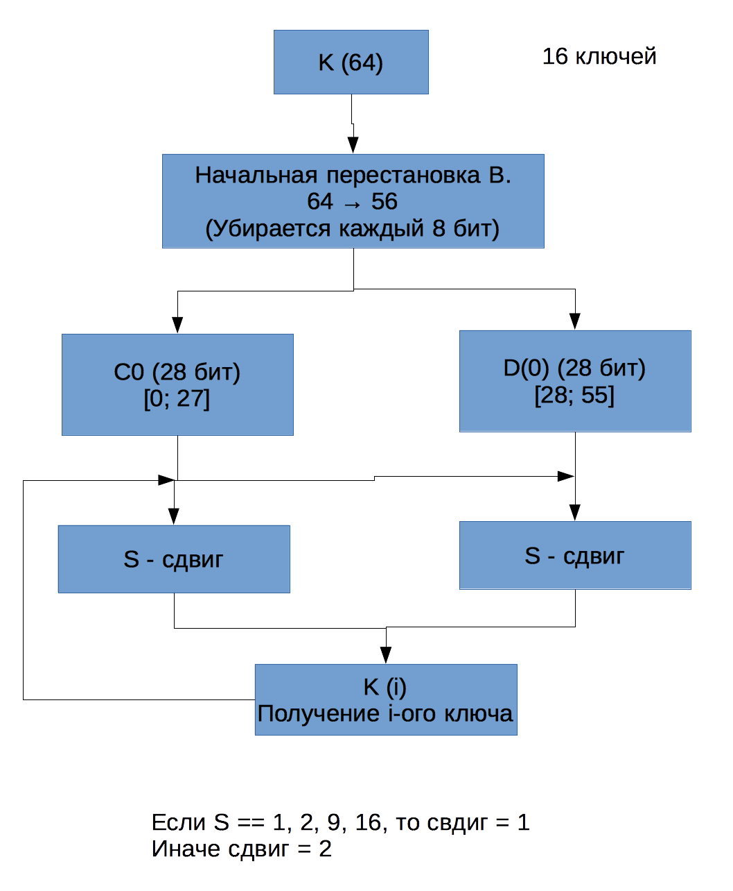
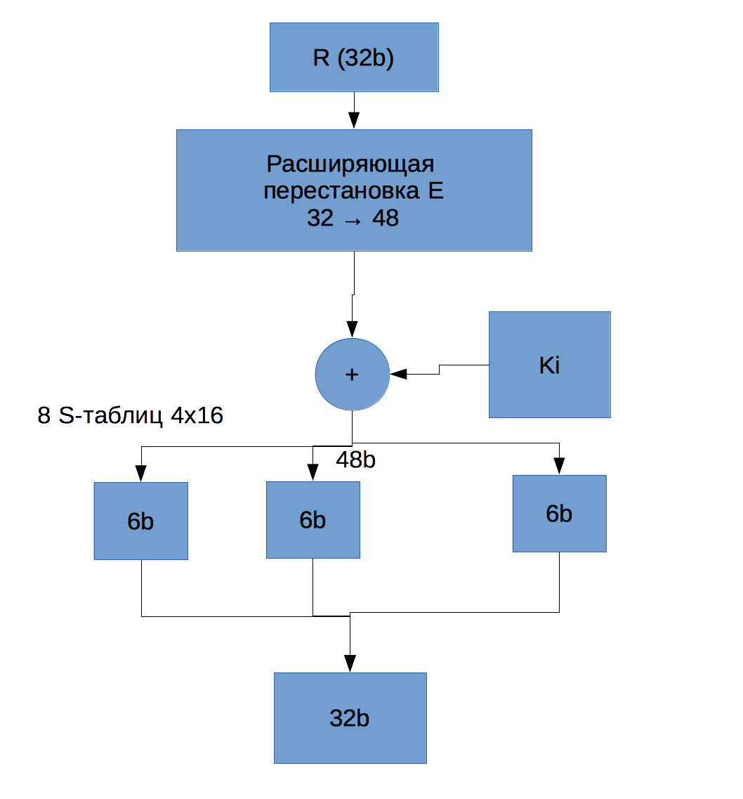
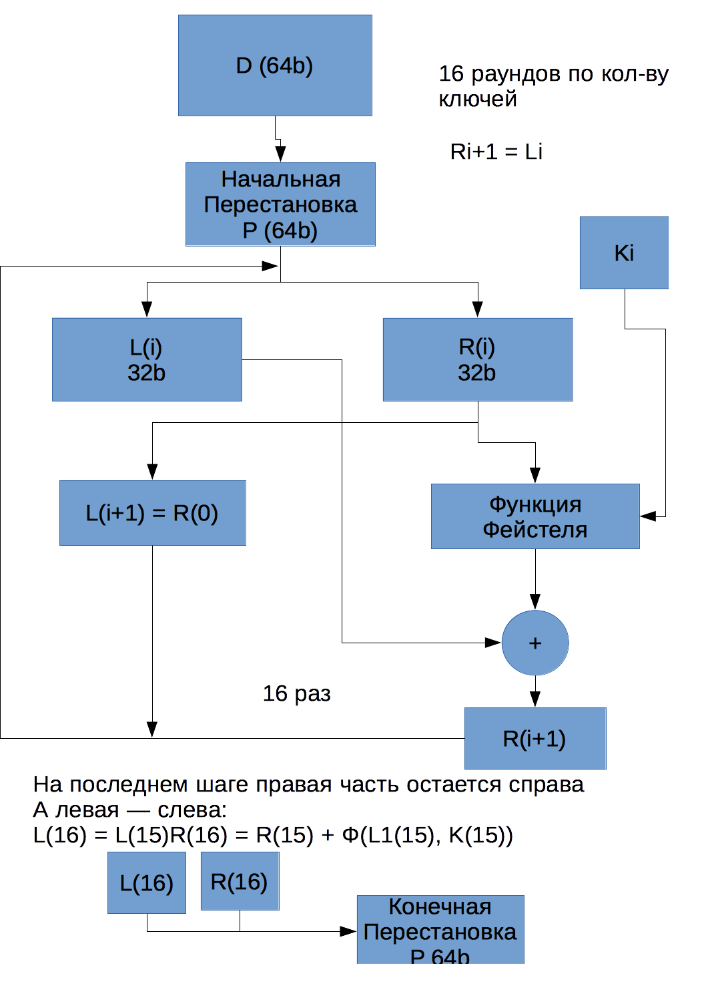

_Преподаватель:_ Григорьев Александр Сергеевич

grigoriev@bmstu.ru

# Лекция 1
### Основные определения

>   __Информация__ - сведения, сообщения или данные, не зависимые от формы их представления. Накопленный опыт человечества.

Жизненный цикл информации:

1.  Создание
2.  Оценка
3.  Подготовка к хранению
4.  Хранение информации
5.  Выборка, поиск информации
6.  Обработка выборки
7.  Использование информации
8.  Отчетные данные
9.  Переход к п. 2

"Обновление" переход к п. 2

>   __Документ__ - Информация, зафиксированная на материальном носителе.

>   __Электронный документ__ - документированная информация, представлена в электронной форме. Воспринимается только с использованием специальных электронных средств.

>   __Защита информации__ - включает в себя три группы мер:

-   Организационно-провавые
-   Структурные
-   Программно-технические

Направлены на действия:

-   Противодействие неправомерным действиям информации. Доступ, уничтожение, блокировка, распространение, предоставление.
-   Соблюдение конфиденциальности информации ограниченного доступа.
-   Реализация права на доступ к информации.


>   __Актив__ - все что имеет ценность для субъекта и находится в его распоряжении

>   __Информационная сфера__ - включает в себя информацию, информационную структуру, субъектов, процедуры и систему регулирования отношений

>   __Угроза__ - опасность, предполагающая возможность потери или ущерба

>   __Безопасность__ - состояние защищенности интересов и целей, в условиях угроз

>   __Информационная безопасность__ - безопасность в условиях угроз в информационной сфере.

Обеспечивает:
-   доступность
-   целостность
-   конфиденциальность
-   неотказуемость - невозможность отказаться от авторства информации
-   подотчетность - некое журналирование, регистрирование работы с информацией
-   аутентичность - подлинность
-   достоверность - информация соответствует предусмотренному поведению и результату

Для реализации необходимо выполнить процедуры:
-   Идентификация - присвоение и проверка уникального имени объекта. Ввод логина
-   Аутентификация - установление и подтверждение пользователем представленного идентификатора. Ввод пароля
-   Авторизация - определение и предоставление прав доступа.

>  __Ценность информации__ - мера ущерба, наносимого нарушением безопасности информации

Может быть оценена:
-   Важная
-   Полезная - рабочая информация
-   Несущественная - временные данные, потеря которых ни к чему не приведет

### Требования к системам защиты информации
Система защиты информации должна отвечать требованиям:
-   Простоты
-   Полноты
-   Изоляции
-   Ответственности
-   Психологической привлекательности

Принципы защиты информации:
-   Обоснованность доступа
-   Достаточная глубина контроля доступа - необходимо регистрировать все обращения к информации
-   Разграничение потоков информации - нельзя помещать секретную информацию на незащищенные носители
-   Частота повторного использования
-   Персональная ответственность
-   Целостность средств защиты информации

```
    Субъект ----- Монитор обращений ----- Объект
                         |
                ---------------------
                |Информационная база|-----
                ---------------------    |
                         |Матрица доступа|
                         -----------------
```

# Лекция 2
## Методы защиты от несанкционированного копирования:

Методы:

1.   По методу воздействия
    -   __Активные__
    -   __Пассивные__
2.   По методу реализации
    -   Внутренние средства самозащиты (ограничение по времени, истечение лицензии)
    -   Видимые средства (различные информационные сообщения, информация о владельце ПО)
    -   Идентификация (метка копирайта)
    -   Информационные средства (водяные знаки, наклейки)
    -   Документация
3.  Защита отдельных составляющих в составе вычислительных систем
    -   Защита носителей информации
        -   Изменение формата записи
        -   Использование специальной метки разметки
    -   Специальная аппаратура (использование спец процессоров выполнения програм)
    -   Серийные номера
    -   Ключи (HASP)
    -   Аппаратная защита
4.  Запрос информации
    -   Запрос различных кодов
    -   Шифрование
    -   Проверка сигнатур
5.  Собственная защита ПО
    -   Документирование кода
    -   Услуги по сопровождению ПО
    -   Заказное проектирование

Характеристики компьютера для привязки:
-   Постоянные
    -   Аппаратные (например серийные номера)
-   Переменные

Критерии параметров:
-   Неизменность
-   Доступность
-   Уникальность

Как можно получить уникальные id

1.  ASM
2.  Windows API
    -   GetWindowsDirectory
    -   GetVolumeInformation
    -   GlobalMemor
    -   GetCurrentHWProfile
3.  WMI -> WQL
    select * from Win32_BIOS
4.  proc
    ```

    ls /proc
    cat /proc/cpuinfo
    ```

__Моделирование угроз__ - цель заставить разработчика конструктивно, на основе формального описания, мыслить при проектировании систем с точки зрения безопасность.

Включает в себя этапы:

1.  __Определение активов__ (ресурсы, секретная информация, средства контроля доступа). Участвует заказчик
2.  __Определение описания архитектуры__. Участвует архитектор, безопастник. Необходимо определить границы системы, возможности и используемые технологии
3.  __Декомпозиция системы__. Участвует инфраструктура и разработчики. Определить области защиты, политики безопасности (проверки ввода данных), проверка важные события (определение точек входа, границы доверия, код(права))
4.  __Определение угроз__
    -   Природные (наводнения, землетрясения)
    -   Техногенные (отказ оборудования, отключение электричества)
    -   Антропогенные (умышленные, целенаправленные или случайные)
5.  __Документирование угроз__. Указывается цель. категория, величина риска  и метод борьбы.
6.  __Оценка серьезности угроз__. Потенциальный ущерб, воспроизводилось угроз, легкость обнаружения, активы, доступность начать атаку.

Методы борьбы с угрозами:
-   Защита
-   Переложение риска на другого
-   Принять риск

### Модели нарушителя

Модель нарушителя:
-   По уровню возможностей
    -   _Низкие_ (имеют доступ к неким предопределенным функциям)
    -   _Средний_ (имеют права на запуск собственных средств с новыми функциями)
    -   _Высокий_ (управляют функционированием системы и могут воздействовать на ПО и оборудование)
    -   _Абсолютный_ (Проектировщики и обслуживающий персонал)
-   Хакеры
    -   _Любители_. Цель получить доступ к ресурсам, доступ для развлечения, попытка что-то доказать, заработок денег, крутизна.
    -   _Профессионалы_. Использование некомпьютерных методов: наем сотрудников, изучение открытой информации, перехват почты, анализ распечаток.

### Группы безопасности

3 Группа (1 пользователь - 1 уровень информации). Подгруппы ЗА, ЗБ

2 Группа (многопользовательские с одними правами, разные уровни информации) Подгруппы 2А, 2Б

1 Группа (многопользовательские системы с различными провами, различные уровни информации) Подгруппы 1А, 1Д

### Модели доступа

__Матрица доступа__

O - объекты, S - субъекты

|     | O1 | O2 | ... |
|-----|----|----|-----|
| S1  | R  | W  |     |
| S2  | RW | R  |     |
| ... |    |    |     |

__Мандатная модель__
-   S1 - 1
-   S2 - 2
-   ...

__Ролевая модель__

Расширение матрицы доступа, путем создания ролей, а не назначения вручную для каждого объекта.

Имеет смысл уделить внимание __системы журналирования__, так как она позволяет выявить часто используемые ресурсы, отслеживать НСД, выявить часто ошибающихся пользователей, восстановить утраченные ресурсы по последовательности действий, а так же оказать психологическое воздействие

# Лекция 3

Области кодирования и шифрования информации:
-	Криптография
-	Криптоанализ

Сокрытие информации - __стеганография__

>	__Шифрование (Encryption)__ — преобразование открытого текста (plain text) в зашифрованный (cipher text).

Шифрование — Enciphering, расшифрование - deciphering.

>	__Рассеивание__ - влияние одного знака открытого текста на множество знаков зашифрованного текста.

Огюст Кергоффе написал книгу «Военная криптография», что повлияло на развитие криптографии.

>	__Стойкость алгоритма определяется только секретностью ключа__

Группы алгоритмов шифрования:

| Симметричные | С открытом ключом (ассиметричные)     |
|--------------|---------------------------------------|
| единый секретный ключ | открытый ключ / секретный ключ |

Так же алгоритмы делятся на:
-	__Блочные__ — ориентированы на различный размер
-	__Поточные__ — ориентированы на поточные данные

Пример алгоритма:
Генерируем поток ключей, применяем сложение по модулю 2 (xor) и шифруем каждый блок сообщения. Для расшифровки необходимо сделать тоже самое

Современные алгоритмы включают в себя:
-   Перестановки (Permutation)
-   Подстановки (Substitution)
-   Составные (P + S)

Примеры алгоритмов:
-   __Отрывные блокноты__
-   __Сцепление блоков шифра__. Есть некий ключ или начальная последовательность. Есть сообщение, которое делится на части. Далее выполняется xor с первым блоком и ключом. Далее полученный блок используется для xor со второй частью. И так до конца. Для расшифровки ситуация повторяется.
-   __Моноалфавитные__. Код цезаря - однозначное соответствие между буквами алфавита и сообщения.

__Шифр Виженера__

| А | Б | ... | Я |
|---|---|-----|---|
| Б | В | ... | А |
| ... | ... | ... | ... |
| Я | А | ... | Ю |
| А | Б | ... | Я |

```
Ключ:      ЯМАЯМАЯМА
Сообщение: СООБЩЕНИЕ
```
Выбирается верхняя буква. По ней выбирается строка. Затем по столбцу с буквой сообщения выбирается замена из строки.

Другой алгоритм.
Задается правило. Например Правило 321. Сообщение передается в виде ООСЕЩБЕИН.

__Квадрат Полибия__

Пишем буквы в квадрат:

| А | Б | В | Г |
|---|---|---|---|
| Д | Е | Ж | З |
| И | К | Л | М |

Нижняя буква заменяется на верхнюю.

-   __Полиалфавитные__ - сокрытие естественной частоты символов в языке.

__Алгоритм Энигма (шифровальная машина)__

Есть механическая машина с колесами, на которых размечаются буквы. Эти буквы имеют контакты с другими буквами, на которые они меняются. Подрят стоят 3 таких колеса. После шифровальной машины состоял рефлектор. Он имел правила заполнения (если X->Y, то Y -> X). После попадания в рефлектор, происходит прохождение в обратном направлении. При шифрование второго символа первое колесо проворачивается. Расшифровка происходит по тому же алгоритму.

### Основные требования к алгоритмам шифрования

1.  Сложность расшифровки модификации
2.  Малое изменение исходного текста или ключа влечет значительное изменение шифра текста
3.  Область значений ключа должна исключать его перебор
4.  Стоимость дешифрации (взломе) сообщения превышает стоимость информации

## Случайные числа

Бывают:
-   __Реально случайными__
    -   _Физические процессы_
    -   _Действия пользователя_
-   __Псевдо случайные__
    -   На основе математического закона

### Алгоритмы получения псевдослучайных чисел
-   __Алгоритм Фон-Неймана__. Берем числа в середине и возводим их в квадрат
```
1234 -> 0529 -> 1704 -> 4900 -> 8100 -> 0100
```
-   __Алгоритм на числах Фибоначчи__
```
1, 1, 2, 3, 5, 8, 13, 21
1 2 3 5 8 3 1
```
-   __Линейно конгруентный генератор__

```
x_{n+1} = (a * x_{n} + c) mod m

a = 106, b = 1283, m = 6075
a = 84589, b = 45989, m = 217728
```

# Лекция 4
## Алгоритм DES (Data Encryption Standart)

Длина ключа K = 64 (реально используются 56)

1.  Расширение ключа
2.  Функция Фейстеля
3.  Алгоритмы шифрования и расшифровки

### Расширение ключа


### Функция Фейстеля


Расширяющая перестановка:
```
32  1 2 3 4 5
4   5 6 ... 9
8   9 ... 1 13
12 13 ...   25
...
20
```



## AES (Advanced Encryption Standart)
```
E = E(K1(D(K2, E(K3))))
D = D(K1(E(K2, D(K3))))

W   32b (4 байта)
Data 4 слова
K   4-8 слов
```

3DES

Требовния на конкурсе алгоритма шифрования.
```
Блок данных 128b
Ключ K      128, 192, 256
```

Слово 4байта = 32 бита
128 - 10 раундов
192 - 12 раундов
256 - 14 раундов

https://ru.wikipedia.org/wiki/Advanced_Encryption_Standard

## RSA

https://ru.wikipedia.org/wiki/RSA

Способ генерации простых чисел: теорема Рабина:

Тестируем на простоту число m. Число m-1 представляем в виде:

```
m-1 = 2^s *t
```

t - нечетное.
число m - простое, если a^t mod m = 1 или существует k[0, s] такое что
```
a^(2^k * t) mod m = m-1
```

Теорема Миллера - Рабина - расширение для алгоритма.

## Хеш-функции

Свойства:
-   Данные произвольной длины.
-   Результат фиксированной длины.
-   Легкость вычисления.
-   Невозможность вычисления исходных данных.
-   Невозможность получить одинаковые хеши на разных данных

Самые известные __md__(Message Digest) и __sha__(Secure Hash Algorithm)

>MD4, MD5

>SHA0, SHA1, SHA2

Длина входного блока md5 - 128b; Sha0: вход - 512b, выход 160b; sha2: вход - 512b и 1Kb  выходные размеры 224b, 256b, 384b, 512b

в sha1 используются 5 констант на входе

в sha2 используются 8 констант

## Электронная подпись
-   Показывает добровольное согласие
-   Подтверждает аутентичность сообшения
-   Непереносимость.
-   Целостность.
-   Неотказуемость.

Модели распростронению ключей:
-   Централизованная (PKI)
-   Децентрализованная (PGP)

__Электронный сертификат__ - сертификат открытого ключа, сертификат цифровой подписи. Цифровой или бумажный документ.

__Центр сертификации__ (Sertification Authority) - централизованный орган, который хранит информацию об открытых ключах.

__Протокол X.509__ Входит информация о владельце, его полномочиях, срок действия, город, e-mail...

### Процедура получения сертификата
1.  Изготовление запроса на выпуск сертификата (Сertificate Signing Request). Содержит открытый ключ.
2.  Выпуск сертиифката центром сертификации. Фиксируется в базе.
3.  Certification Revocation List - список отозванных сертификатов. Сертификат можно отозвать.
4.  Процедура проверки включает в себя проверку срока действия и принадлежность к списку отозванных сертификатов.
